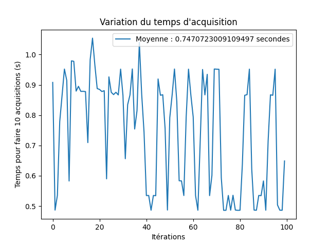

# Log d'avancement Stage Smartcatcher

Ici je logge mes avancements de semaine en semaine.

## Semaine 1 : 4/05 - 11/05

* Arrangement de l'espace de travail
* Vérification du matériel

## Semaine 2 : 11/05 - 18/05

* Recherches pour faire une unité d'affichage des données externe au programme (dans le but de ne pas le ralentir inutilement)
* Recherches sur meilleurs protocoles et librairies à utiliser : je considère un switch de pySerial vers pyTTY

* Mesure de la vitesse actuelle d'acquisition de données

* Avec 4 capteurs connectés, on est à 50 Hz ce qui me parait très correct.
  `--- 0.20351595878601075 seconds ---` 

## Semaine 3 : 18/05 - 25/05

* Tests de communication en utilisant http et les websocket avec python mais MQTT à l'air intéressant et vraiment moins couteux : voir https://medium.com/@flespi/http-vs-mqtt-performance-tests-f9adde693b5f
* Protocole de communication avec MQTT mis en place avec succès.

* MQTT utilisé avec python et matplotlib pour avoir du plotting en temps réel, fonctionne mais c'est toujours très lent.
* Recherches sur pyqtgraph, solution beaucoup plus performante pour le graphing, difficultés à le faire fonctionner correctement dans mon workflow, à cause d'intéractions bizarres avec le WSL

## Semaine 4 : 25/05 - 01/06

* Au final les data arrivent pas si vite donc je vais me concentrer sur matplotlib pour le moment et essayer d'optimiser les performances au besoin, comme ça j'aurai des mesures.
* J'ai de mesures en live mais au bout de quelques minutes, un délai se forme, il a donc toujours une lenteur provoquée par matlplotlib
